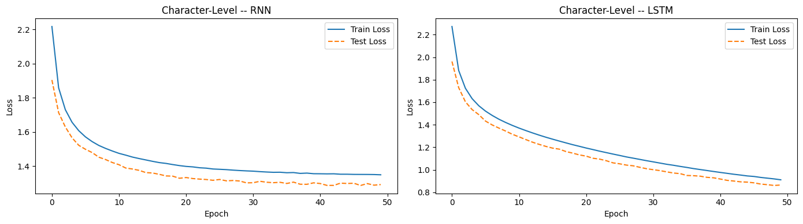
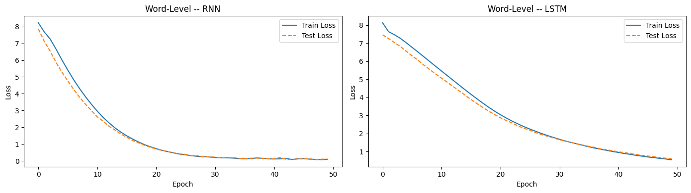

# Arabic Text Generation — RNN vs LSTM

Character-level and word-level Arabic text generation, comparing **SimpleRNN** and **LSTM** architectures, trained on a custom sports corpus collected from Arabic Wikipedia.

**Author:** Abdallah Saed (202201933)

---

## 📌 Project Overview

This project explores Arabic text generation by training and comparing two recurrent architectures (SimpleRNN and LSTM) at two tokenization granularities (character-level and word-level), across 50 training epochs each.

**Pipeline:**
1. Collect Arabic sports articles via the Wikipedia API
2. Clean and normalize the text (remove tashkeel, normalize alef/ya, strip non-Arabic characters)
3. Encode at character-level (33 unique chars) and word-level (9,559 unique words)
4. Train RNN and LSTM models at both granularities (80/20 train/test split)
5. Compare loss curves and generated text quality
6. Deploy an interactive demo with Gradio

## 🗂️ Repo Structure

```
.
├── notebook/
│   └── arabic_text_generation_rnn_vs_lstm.ipynb   # Full pipeline: data → preprocessing → training → generation → Gradio demo
├── assets/
│   ├── char_level_loss.png                        # Train/test loss curves — character level
│   └── word_level_loss.png                        # Train/test loss curves — word level
├── requirements.txt
└── README.md
```

## 📊 Data

- **Source:** Arabic Wikipedia API (`extracts` endpoint)
- **Topics:** 35 sports topics (كرة القدم, كرة السلة, سباحة, ملاكمة, ...)
- **Filter:** articles under 50 words discarded; collection stopped at 20 valid articles
- **Split:** 80% train / 20% test, sliding-window sequences (50 chars / 20 words → next token)

## 🧹 Preprocessing

| Step | Description |
|---|---|
| Remove tashkeel | Strip Arabic diacritics (Unicode `U+064B`–`U+065F`) |
| Normalize alef | Unify إ / أ / آ → ا |
| Normalize ya | Alef Maqsura ى → ي |
| Strip non-Arabic | Remove digits, punctuation, Latin chars, symbols |
| Collapse whitespace | Multiple spaces → single space, trimmed |

## 🧠 Model Architecture

Both models share the same shape, differing only in the recurrent layer:

```
Input → Embedding(128) → [SimpleRNN | LSTM](128, return_sequences=True) → [SimpleRNN | LSTM](128) → Dense(vocab_size, softmax)
```

- Optimizer: Adam · Loss: Sparse Categorical Crossentropy
- 50 epochs, checkpoints saved at epochs 10 / 20 / 50
- Char-level: batch size 128, seq_len 50 · Word-level: batch size 64, seq_len 20

## 📈 Results

### Character-Level



LSTM achieves consistently lower loss than RNN at every checkpoint. The RNN plateaus around epoch 30 (vanishing gradients), while LSTM keeps improving through epoch 50 — a **~30% lower final loss**.

### Word-Level



RNN reaches a lower *numerical* loss (~0.10 vs ~0.60 for LSTM), but this reflects memorization over a large 9,559-word vocabulary rather than true generalization. Neither model overfits — train/test curves track closely throughout.

### Generated Text — Seed: `"كرة القدم هي رياضة"`

| Model | Epoch 50 sample |
|---|---|
| RNN (char) | كرة القدم هي رياضة من خلال جزءا من الاغاصة في السلة الي الانهار في تعدد عندما الفرنسي الجماعية... |
| LSTM (char) | كرة القدم هي رياضة مقارة مثل هذه المباراة من قبل الايابا علي الاتحاد الدولي وذلك بمهارة فترة مباشرة... |
| RNN (word) | كرة القدم هي رياضة يقوم والاتحاد مباراة ويبقي تم اللعبة وهي الهدف بين شوط بالكرة الهواة... |
| LSTM (word) | كرة القدم هي رياضة الكرة ان ان رمية رمية المدافع الخصم اذا ان اللاعب من الكرة من الاهداف... |

## ✅ Conclusion

**LSTM is the stronger architecture for character-level Arabic text generation** — lower loss and noticeably more coherent output. At word-level, RNN wins on raw loss through memorization, but LSTM produces more semantically consistent sentences at epoch 50.

## 🚀 Running the Project

```bash
pip install -r requirements.txt
jupyter notebook notebook/arabic_text_generation_rnn_vs_lstm.ipynb
```

The notebook includes a Gradio cell at the end for an interactive demo (pick model type, tokenization level, checkpoint epoch, seed text, and sampling temperature).

> **Note:** the notebook was developed on Google Colab and mounts Google Drive to persist the collected corpus (`/content/drive/MyDrive/arabic_nlp/sports_articles.json`). Adjust the data-loading cell if running locally.

## 🛠️ Tech Stack

`TensorFlow / Keras` · `NumPy` · `Matplotlib` · `Gradio` · `Wikipedia API`
